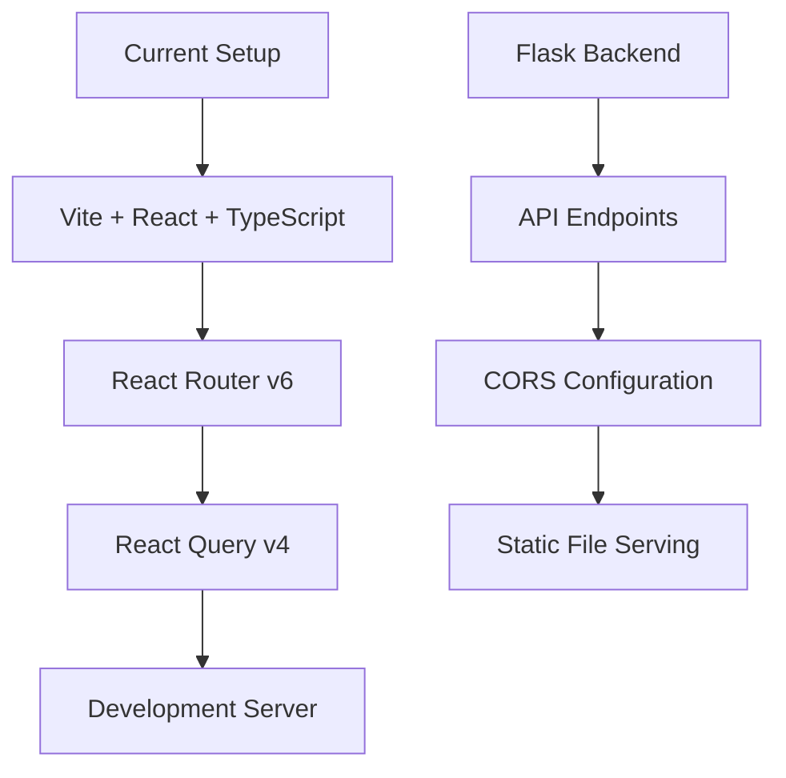
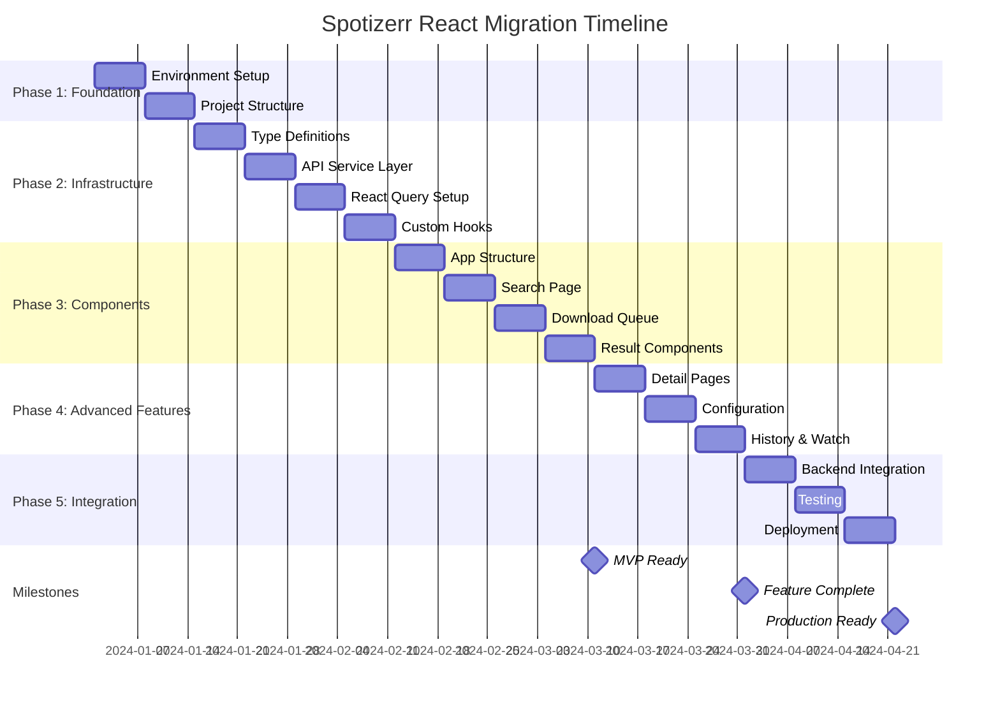

# Spotizerr Frontend Migration Plan: Vanilla TypeScript → React + React Query SPA

## Executive Summary

This plan outlines the migration of Spotizerr's frontend from a multi-page vanilla TypeScript application to a modern single-page React application with React Query for state management. The migration will preserve the existing functionality while modernizing the architecture for better maintainability, performance, and developer experience.

## Current Architecture Analysis

### Existing Frontend Structure
- **Multi-page application** with 8 separate HTML pages
- **Vanilla TypeScript** with modular component architecture (2,895 lines in queue.ts alone)
- **Centralized download queue** management with sophisticated progress tracking
- **Manual DOM manipulation** and event handling
- **Static HTML** served by Flask with Jinja2 templating
- **Modular CSS** with custom properties and component-specific stylesheets

### Key Strengths to Preserve
- **Sophisticated download queue system** with real-time progress tracking
- **Comprehensive error handling** and retry mechanisms
- **Well-structured TypeScript interfaces** and type safety
- **Responsive design** with dark theme
- **Accessibility features** (ARIA labels, keyboard navigation)

## Migration Strategy

### Phase 1: Foundation Setup
**Duration: 1-2 weeks**

#### 1.1 Development Environment Setup



**Installation Commands:**
```bash
# Create new frontend directory
mkdir frontend
cd frontend

# Initialize Vite React TypeScript project
npm create vite@latest . -- --template react-ts

# Install additional dependencies
npm install @tanstack/react-query @tanstack/react-query-devtools
npm install react-router-dom
npm install @types/node

# Install development dependencies
npm install -D @types/react-router-dom
```

**Vite Configuration:**
```typescript
// vite.config.ts
import { defineConfig } from 'vite'
import react from '@vitejs/plugin-react'
import path from 'path'

export default defineConfig({
  plugins: [react()],
  resolve: {
    alias: {
      '@': path.resolve(__dirname, './src'),
      '@components': path.resolve(__dirname, './src/components'),
      '@pages': path.resolve(__dirname, './src/pages'),
      '@hooks': path.resolve(__dirname, './src/hooks'),
      '@services': path.resolve(__dirname, './src/services'),
      '@utils': path.resolve(__dirname, './src/utils'),
      '@styles': path.resolve(__dirname, './src/styles'),
    },
  },
  build: {
    outDir: '../static/react',
    emptyOutDir: true,
    rollupOptions: {
      output: {
        manualChunks: {
          vendor: ['react', 'react-dom'],
          router: ['react-router-dom'],
          query: ['@tanstack/react-query'],
        },
      },
    },
  },
  server: {
    proxy: {
      '/api': {
        target: 'http://localhost:7171',
        changeOrigin: true,
      },
      '/static/images': {
        target: 'http://localhost:7171',
        changeOrigin: true,
      },
    },
  },
})
```

#### 1.2 Project Structure
```
frontend/
├── src/
│   ├── components/           # Reusable UI components
│   │   ├── common/          # Shared components
│   │   │   ├── LoadingSpinner.tsx
│   │   │   ├── ErrorBoundary.tsx
│   │   │   └── FloatingActionButtons.tsx
│   │   ├── search/          # Search-related components
│   │   │   ├── SearchInterface.tsx
│   │   │   ├── SearchInput.tsx
│   │   │   ├── SearchResults.tsx
│   │   │   └── ResultCard.tsx
│   │   ├── queue/           # Download queue components
│   │   │   ├── DownloadQueue.tsx
│   │   │   ├── QueueItem.tsx
│   │   │   ├── ProgressBar.tsx
│   │   │   └── QueueControls.tsx
│   │   └── ui/              # Basic UI elements
│   │       ├── Button.tsx
│   │       ├── Input.tsx
│   │       └── Modal.tsx
│   ├── pages/               # Page-level components
│   │   ├── SearchPage.tsx
│   │   ├── AlbumPage.tsx
│   │   ├── PlaylistPage.tsx
│   │   ├── ArtistPage.tsx
│   │   ├── TrackPage.tsx
│   │   ├── ConfigPage.tsx
│   │   ├── HistoryPage.tsx
│   │   └── WatchPage.tsx
│   ├── hooks/               # Custom React hooks
│   │   ├── useDownloadQueue.ts
│   │   ├── useSearch.ts
│   │   ├── useConfig.ts
│   │   ├── useProgress.ts
│   │   └── useLocalStorage.ts
│   ├── services/            # API service layer
│   │   ├── api.ts
│   │   ├── downloadService.ts
│   │   ├── searchService.ts
│   │   └── types.ts
│   ├── store/               # Global state management
│   │   ├── downloadQueue.ts
│   │   ├── config.ts
│   │   └── queryClient.ts
│   ├── utils/               # Utility functions
│   │   ├── formatters.ts
│   │   ├── validators.ts
│   │   └── constants.ts
│   ├── styles/              # Existing CSS imports
│   │   ├── index.css
│   │   └── components/
│   ├── App.tsx
│   ├── main.tsx
│   └── vite-env.d.ts
├── public/                  # Static assets
│   └── index.html
├── package.json
├── tsconfig.json
├── tsconfig.node.json
└── vite.config.ts
```

**TypeScript Configuration:**
```json
// tsconfig.json
{
  "compilerOptions": {
    "target": "ES2020",
    "useDefineForClassFields": true,
    "lib": ["ES2020", "DOM", "DOM.Iterable"],
    "module": "ESNext",
    "skipLibCheck": true,
    "moduleResolution": "bundler",
    "allowImportingTsExtensions": true,
    "resolveJsonModule": true,
    "isolatedModules": true,
    "noEmit": true,
    "jsx": "react-jsx",
    "strict": true,
    "noUnusedLocals": true,
    "noUnusedParameters": true,
    "noFallthroughCasesInSwitch": true,
    "baseUrl": ".",
    "paths": {
      "@/*": ["./src/*"],
      "@components/*": ["./src/components/*"],
      "@pages/*": ["./src/pages/*"],
      "@hooks/*": ["./src/hooks/*"],
      "@services/*": ["./src/services/*"],
      "@utils/*": ["./src/utils/*"],
      "@styles/*": ["./src/styles/*"]
    }
  },
  "include": ["src"],
  "references": [{ "path": "./tsconfig.node.json" }]
}
```

### Phase 2: Core Infrastructure Migration
**Duration: 2-3 weeks**

#### 2.1 Type Definitions Migration

```typescript
// services/types.ts
// Migrate existing interfaces from the TypeScript files

export interface Image {
  url: string;
  height?: number;
  width?: number;
}

export interface Artist {
  id?: string;
  name: string;
  external_urls?: { spotify?: string };
  genres?: string[];
}

export interface Album {
  id?: string;
  name: string;
  images?: Image[];
  album_type?: string;
  artists?: Artist[];
  total_tracks?: number;
  release_date?: string;
  external_urls?: { spotify?: string };
}

export interface Track {
  id: string;
  name: string;
  artists: Artist[];
  album: Album;
  duration_ms?: number;
  explicit?: boolean;
  external_urls: { spotify: string };
  href?: string;
}

export interface Playlist {
  id: string;
  name: string;
  owner: { display_name?: string; id?: string };
  images?: Image[];
  tracks: { total: number };
  external_urls: { spotify: string };
  href?: string;
  explicit?: boolean;
}

export type SearchResultItem = Track | Album | Playlist | Artist;

export interface SearchResponse {
  items: SearchResultItem[];
}

// Queue-related types
export interface QueueItem {
  name?: string;
  music?: string;
  song?: string;
  artist?: string;
  artists?: { name: string }[];
  album?: { name: string };
  owner?: string | { display_name?: string };
  total_tracks?: number;
  url?: string;
  type?: string;
  parent?: ParentInfo;
  display_title?: string;
  display_artist?: string;
  endpoint?: string;
  download_type?: string;
  [key: string]: any;
}

export interface ParentInfo {
  type: 'album' | 'playlist';
  title?: string;
  artist?: string;
  name?: string;
  owner?: string;
  total_tracks?: number;
  url?: string;
  [key: string]: any;
}

export interface StatusData {
  type?: 'track' | 'album' | 'playlist' | 'episode' | string;
  status?: 'initializing' | 'skipped' | 'retrying' | 'real-time' | 'error' | 'done' | 'processing' | 'queued' | 'progress' | 'track_progress' | 'complete' | 'cancelled' | 'cancel' | 'interrupted' | string;
  url?: string;
  convert_to?: string;
  bitrate?: string;
  song?: string;
  artist?: string;
  album?: string;
  title?: string;
  name?: string;
  owner?: string;
  parent?: ParentInfo;
  current_track?: number | string;
  total_tracks?: number | string;
  progress?: number | string;
  time_elapsed?: number;
  reason?: string;
  error?: string;
  retry_count?: number;
  seconds_left?: number;
  summary?: {
    successful_tracks?: string[];
    skipped_tracks?: string[];
    failed_tracks?: { track: string; reason: string }[];
    total_successful?: number;
    total_skipped?: number;
    total_failed?: number;
  };
  task_id?: string;
  can_retry?: boolean;
  max_retries?: number;
  original_url?: string;
  position?: number;
  original_request?: {
    url?: string;
    retry_url?: string;
    name?: string;
    artist?: string;
    type?: string;
    endpoint?: string;
    download_type?: string;
    display_title?: string;
    display_type?: string;
    display_artist?: string;
    service?: string;
    [key: string]: any;
  };
  event?: string;
  overall_progress?: number;
  display_type?: string;
  [key: string]: any;
}

export interface QueueEntry {
  item: QueueItem;
  type: string;
  taskId: string;
  requestUrl: string | null;
  element?: HTMLElement; // Will be removed in React version
  lastStatus: StatusData;
  lastUpdated: number;
  hasEnded: boolean;
  intervalId: number | null;
  uniqueId: string;
  retryCount: number;
  autoRetryInterval: number | null;
  isNew: boolean;
  status: string;
  lastMessage: string;
  parentInfo: ParentInfo | null;
  isRetrying?: boolean;
  progress?: number;
  realTimeStallDetector: { count: number; lastStatusJson: string };
  [key: string]: any;
}

export interface AppConfig {
  downloadQueueVisible?: boolean;
  maxRetries?: number;
  retryDelaySeconds?: number;
  retry_delay_increase?: number;
  explicitFilter?: boolean;
  [key: string]: any;
}
```

#### 2.2 API Service Layer with React Query

```typescript
// services/api.ts
const API_BASE = '/api';

export class ApiError extends Error {
  constructor(
    message: string,
    public status: number,
    public response?: Response
  ) {
    super(message);
    this.name = 'ApiError';
  }
}

async function apiRequest<T>(
  endpoint: string,
  options: RequestInit = {}
): Promise<T> {
  const url = `${API_BASE}${endpoint}`;

  const response = await fetch(url, {
    headers: {
      'Content-Type': 'application/json',
      ...options.headers,
    },
    ...options,
  });

  if (!response.ok) {
    const errorText = await response.text();
    throw new ApiError(
      `API request failed: ${response.status} ${errorText}`,
      response.status,
      response
    );
  }

  return response.json();
}

export const api = {
  // Search endpoints
  search: (query: string, searchType: string, limit = 40) =>
    apiRequest<SearchResponse>(
      `/search?q=${encodeURIComponent(query)}&search_type=${searchType}&limit=${limit}`
    ),

  // Download endpoints
  startDownload: (itemId: string, type: string, albumType?: string) => {
    const params = new URLSearchParams();
    if (albumType) params.append('album_type', albumType);
    const queryString = params.toString();
    const url = `/download/${type}/${itemId}${queryString ? `?${queryString}` : ''}`;

    return apiRequest<{ task_id?: string; task_ids?: string[]; album_prg_files?: string[] }>(
      url,
      { method: 'POST' }
    );
  },

  cancelDownload: (taskId: string, type: string) =>
    apiRequest<{ status: string }>(`/${type}/download/cancel?task_id=${taskId}`, {
      method: 'POST',
    }),

  // Progress endpoints
  getProgress: (taskId: string) =>
    apiRequest<StatusData>(`/prgs/${taskId}`),

  getActiveDownloads: () =>
    apiRequest<any[]>('/prgs/list'),

  // Info endpoints
  getTrackInfo: (id: string) =>
    apiRequest<Track>(`/track/info?id=${id}`),

  getAlbumInfo: (id: string) =>
    apiRequest<Album>(`/album/info?id=${id}`),

  getPlaylistInfo: (id: string) =>
    apiRequest<Playlist>(`/playlist/info?id=${id}`),

  getArtistInfo: (id: string) =>
    apiRequest<Artist>(`/artist/info?id=${id}`),

  // Configuration endpoints
  getConfig: () =>
    apiRequest<AppConfig>('/config'),

  updateConfig: (config: Partial<AppConfig>) =>
    apiRequest<AppConfig>('/config', {
      method: 'POST',
      body: JSON.stringify(config),
    }),

  getWatchConfig: () =>
    apiRequest<{ enabled: boolean }>('/config/watch'),

  // History endpoints
  getHistory: (page = 1, limit = 50, filters?: any) => {
    const params = new URLSearchParams({
      page: page.toString(),
      limit: limit.toString(),
      ...filters,
    });
    return apiRequest<any>(`/history?${params}`);
  },

  // Watch endpoints
  getWatchList: () =>
    apiRequest<any[]>('/watchlist'),

  addToWatch: (id: string, type: string) =>
    apiRequest<any>(`/${type}/watch/${id}`, { method: 'POST' }),

  removeFromWatch: (id: string, type: string) =>
    apiRequest<any>(`/${type}/watch/${id}`, { method: 'DELETE' }),

  triggerWatchCheck: (type: 'playlist' | 'artist') =>
    apiRequest<any>(`/${type}/watch/trigger_check`, { method: 'POST' }),
};
```

#### 2.3 React Query Setup

```typescript
// store/queryClient.ts
import { QueryClient } from '@tanstack/react-query';

export const queryClient = new QueryClient({
  defaultOptions: {
    queries: {
      staleTime: 5 * 60 * 1000, // 5 minutes
      retry: (failureCount, error) => {
        // Don't retry on 4xx errors
        if (error instanceof Error && 'status' in error) {
          const status = (error as any).status;
          if (status >= 400 && status < 500) return false;
        }
        return failureCount < 3;
      },
      refetchOnWindowFocus: false,
    },
    mutations: {
      retry: 1,
    },
  },
});

// Query keys factory
export const queryKeys = {
  all: ['spotizerr'] as const,

  // Search
  search: (query: string, type: string) =>
    [...queryKeys.all, 'search', query, type] as const,

  // Downloads
  downloads: () => [...queryKeys.all, 'downloads'] as const,
  activeDownloads: () => [...queryKeys.downloads(), 'active'] as const,
  progress: (taskId: string) => [...queryKeys.downloads(), 'progress', taskId] as const,

  // Content info
  info: () => [...queryKeys.all, 'info'] as const,
  trackInfo: (id: string) => [...queryKeys.info(), 'track', id] as const,
  albumInfo: (id: string) => [...queryKeys.info(), 'album', id] as const,
  playlistInfo: (id: string) => [...queryKeys.info(), 'playlist', id] as const,
  artistInfo: (id: string) => [...queryKeys.info(), 'artist', id] as const,

  // Config
  config: () => [...queryKeys.all, 'config'] as const,
  watchConfig: () => [...queryKeys.config(), 'watch'] as const,

  // History
  history: (page: number, filters?: any) =>
    [...queryKeys.all, 'history', page, filters] as const,

  // Watch
  watch: () => [...queryKeys.all, 'watch'] as const,
  watchList: () => [...queryKeys.watch(), 'list'] as const,
};
```

#### 2.4 Custom Hooks for Business Logic

```typescript
// hooks/useDownloadQueue.ts
import { useState, useCallback, useEffect } from 'react';
import { useMutation, useQuery, useQueryClient } from '@tanstack/react-query';
import { api } from '@services/api';
import { queryKeys } from '@store/queryClient';
import { QueueEntry, QueueItem, StatusData } from '@services/types';
import { useLocalStorage } from './useLocalStorage';

export const useDownloadQueue = () => {
  const queryClient = useQueryClient();
  const [queue, setQueue] = useState<QueueEntry[]>([]);
  const [isVisible, setIsVisible] = useLocalStorage('downloadQueueVisible', false);
  const [visibleCount, setVisibleCount] = useLocalStorage('downloadQueueVisibleCount', 10);

  // Get active downloads from server
  const { data: activeDownloads } = useQuery({
    queryKey: queryKeys.activeDownloads(),
    queryFn: api.getActiveDownloads,
    refetchInterval: 10000, // Sync every 10 seconds
  });

  // Add download mutation
  const addDownload = useMutation({
    mutationFn: async ({
      itemId,
      type,
      item,
      albumType
    }: {
      itemId: string;
      type: string;
      item: QueueItem;
      albumType?: string;
    }) => {
      const result = await api.startDownload(itemId, type, albumType);
      return { result, item, type };
    },
    onSuccess: ({ result, item, type }) => {
      // Handle different response types
      if ('task_id' in result && result.task_id) {
        // Single download
        addToQueue(item, type, result.task_id);
      } else if ('task_ids' in result && result.task_ids) {
        // Multiple downloads (artist)
        result.task_ids.forEach(taskId => {
          const albumItem: QueueItem = {
            name: `${item.name || 'Artist'} - Album (loading...)`,
            artist: item.name || 'Unknown artist',
            type: 'album'
          };
          addToQueue(albumItem, 'album', taskId);
        });
      } else if ('album_prg_files' in result && result.album_prg_files) {
        // Legacy format
        result.album_prg_files.forEach(prgFile => {
          const albumItem: QueueItem = {
            name: `${item.name || 'Artist'} - Album (loading...)`,
            artist: item.name || 'Unknown artist',
            type: 'album'
          };
          addToQueue(albumItem, 'album', prgFile);
        });
      }

      // Show queue after adding
      setIsVisible(true);
    },
  });

  // Cancel download mutation
  const cancelDownload = useMutation({
    mutationFn: ({ taskId, type }: { taskId: string; type: string }) =>
      api.cancelDownload(taskId, type),
    onSuccess: (_, { taskId }) => {
      removeFromQueue(taskId);
    },
  });

  // Cancel all downloads
  const cancelAllDownloads = useMutation({
    mutationFn: async () => {
      const promises = queue
        .filter(entry => !entry.hasEnded)
        .map(entry => api.cancelDownload(entry.taskId, entry.type));

      await Promise.allSettled(promises);
    },
    onSuccess: () => {
      setQueue(prev => prev.map(entry => ({ ...entry, hasEnded: true })));
      // Clear queue after a short delay
      setTimeout(() => setQueue([]), 1000);
    },
  });

  const addToQueue = useCallback((item: QueueItem, type: string, taskId: string) => {
    const queueId = generateQueueId();
    const entry: QueueEntry = {
      item,
      type,
      taskId,
      requestUrl: null,
      lastStatus: {
        type,
        status: 'initializing',
        name: item.name || 'Unknown',
        artist: item.artist || '',
        title: item.name || '',
      },
      lastUpdated: Date.now(),
      hasEnded: false,
      intervalId: null,
      uniqueId: queueId,
      retryCount: 0,
      autoRetryInterval: null,
      isNew: true,
      status: 'initializing',
      lastMessage: `Initializing ${type} download...`,
      parentInfo: null,
      realTimeStallDetector: { count: 0, lastStatusJson: '' },
    };

    setQueue(prev => [...prev, entry]);
    return queueId;
  }, []);

  const removeFromQueue = useCallback((taskId: string) => {
    setQueue(prev => prev.filter(entry => entry.taskId !== taskId));
  }, []);

  const updateQueueEntry = useCallback((taskId: string, updates: Partial<QueueEntry>) => {
    setQueue(prev => prev.map(entry =>
      entry.taskId === taskId ? { ...entry, ...updates } : entry
    ));
  }, []);

  const toggleVisibility = useCallback((force?: boolean) => {
    setIsVisible(prev => force !== undefined ? force : !prev);
  }, [setIsVisible]);

  const generateQueueId = () => {
    return Date.now().toString() + Math.random().toString(36).substr(2, 9);
  };

  // Load existing tasks on mount
  useEffect(() => {
    if (activeDownloads) {
      const terminalStates = ['complete', 'done', 'cancelled', 'ERROR_AUTO_CLEANED', 'ERROR_RETRIED', 'cancel', 'interrupted', 'error'];

      activeDownloads.forEach(taskData => {
        const lastStatus = taskData.last_status_obj;

        // Skip terminal tasks
        if (lastStatus && terminalStates.includes(lastStatus.status)) {
          return;
        }

        // Check if already in queue
        const existsInQueue = queue.some(entry => entry.taskId === taskData.task_id);
        if (!existsInQueue) {
          let itemType = taskData.type || 'unknown';
          let dummyItem: QueueItem = {
            name: taskData.name || taskData.task_id,
            artist: taskData.artist || '',
            type: itemType,
          };

          // Handle track with parent
          if (lastStatus?.type === 'track' && lastStatus.parent) {
            const parent = lastStatus.parent;
            if (parent.type === 'album') {
              itemType = 'album';
              dummyItem = {
                name: parent.title || 'Unknown Album',
                artist: parent.artist || 'Unknown Artist',
                type: 'album',
              };
            } else if (parent.type === 'playlist') {
              itemType = 'playlist';
              dummyItem = {
                name: parent.name || 'Unknown Playlist',
                owner: parent.owner || 'Unknown Creator',
                type: 'playlist',
              };
            }
          }

          addToQueue(dummyItem, itemType, taskData.task_id);
        }
      });
    }
  }, [activeDownloads, queue, addToQueue]);

  return {
    queue,
    isVisible,
    visibleCount,
    setVisibleCount,
    addDownload: addDownload.mutate,
    cancelDownload: cancelDownload.mutate,
    cancelAllDownloads: cancelAllDownloads.mutate,
    toggleVisibility,
    updateQueueEntry,
    isAddingDownload: addDownload.isPending,
    isCancellingDownload: cancelDownload.isPending,
    isCancellingAll: cancelAllDownloads.isPending,
  };
};
```

```typescript
// hooks/useProgress.ts
import { useQuery } from '@tanstack/react-query';
import { api } from '@services/api';
import { queryKeys } from '@store/queryClient';

export const useProgress = (taskId: string, enabled = true) => {
  return useQuery({
    queryKey: queryKeys.progress(taskId),
    queryFn: () => api.getProgress(taskId),
    refetchInterval: enabled ? 500 : false, // Fast updates for active downloads
    enabled: enabled && !!taskId,
    retry: (failureCount, error) => {
      // Stop retrying if task not found (404)
      if (error instanceof Error && 'status' in error && (error as any).status === 404) {
        return false;
      }
      return failureCount < 3;
    },
  });
};
```

```typescript
// hooks/useSearch.ts
import { useState } from 'react';
import { useQuery } from '@tanstack/react-query';
import { useSearchParams } from 'react-router-dom';
import { api } from '@services/api';
import { queryKeys } from '@store/queryClient';
import { SearchResultItem } from '@services/types';

export const useSearch = () => {
  const [searchParams, setSearchParams] = useSearchParams();
  const [query, setQuery] = useState(searchParams.get('q') || '');
  const [searchType, setSearchType] = useState(searchParams.get('type') || 'track');

  const { data: results, isLoading, error } = useQuery({
    queryKey: queryKeys.search(query, searchType),
    queryFn: () => api.search(query, searchType),
    enabled: query.length > 0,
    staleTime: 2 * 60 * 1000, // 2 minutes
  });

  const performSearch = (newQuery?: string, newType?: string) => {
    const finalQuery = newQuery ?? query;
    const finalType = newType ?? searchType;

    if (finalQuery.trim()) {
      setQuery(finalQuery);
      setSearchType(finalType);

      // Update URL
      setSearchParams({
        q: finalQuery,
        type: finalType,
      });
    }
  };

  const isSpotifyUrl = (url: string): boolean => {
    return url.includes('open.spotify.com') ||
           url.includes('spotify:') ||
           url.includes('link.tospotify.com');
  };

  const getSpotifyResourceDetails = (url: string): { type: string; id: string } | null => {
    const regex = /spotify\.com\/(?:[^\/]+\/)??(track|album|playlist|artist)\/([a-zA-Z0-9]+)/i;
    const match = url.match(regex);

    if (match) {
      return {
        type: match[1],
        id: match[2]
      };
    }
    return null;
  };

  const filterValidItems = (items: SearchResultItem[], type: string): SearchResultItem[] => {
    if (!items) return [];

    return items.filter(item => {
      if (!item) return false;

      // Skip explicit content if filter is enabled
      // This will be handled by a config hook

      switch (type) {
        case 'track':
          const trackItem = item as any;
          return (
            trackItem.name &&
            trackItem.artists &&
            trackItem.artists.length > 0 &&
            trackItem.artists[0]?.name &&
            trackItem.album?.name &&
            trackItem.external_urls?.spotify
          );

        case 'album':
          const albumItem = item as any;
          return (
            albumItem.name &&
            albumItem.artists &&
            albumItem.artists.length > 0 &&
            albumItem.artists[0]?.name &&
            albumItem.external_urls?.spotify
          );

        case 'playlist':
          const playlistItem = item as any;
          return (
            playlistItem.name &&
            playlistItem.owner?.display_name &&
            playlistItem.tracks &&
            playlistItem.external_urls?.spotify
          );

        case 'artist':
          const artistItem = item as any;
          return (
            artistItem.name &&
            artistItem.external_urls?.spotify
          );

        default:
          return true;
      }
    });
  };

  return {
    query,
    setQuery,
    searchType,
    setSearchType,
    results: results?.items || [],
    isLoading,
    error,
    performSearch,
    isSpotifyUrl,
    getSpotifyResourceDetails,
    filterValidItems,
  };
};
```

```typescript
// hooks/useConfig.ts
import { useQuery, useMutation, useQueryClient } from '@tanstack/react-query';
import { api } from '@services/api';
import { queryKeys } from '@store/queryClient';
Config } from '@services/types';

export const useConfig = () => {
  const queryClient = useQueryClient();

  const { data: config, isLoading } = useQuery({
    queryKey: queryKeys.config(),
    queryFn: api.getConfig,
    staleTime: 10 * 60 * 1000, // 10 minutes
  });

  const updateConfig = useMutation({
    mutationFn: (updates: Partial<AppConfig>) => api.updateConfig(updates),
    onSuccess: (newConfig) => {
      queryClient.setQueryData(queryKeys.config(), newConfig);
    },
  });

  return {
    config: config || {},
    isLoading,
    updateConfig: updateConfig.mutate,
    isUpdating: updateConfig.isPending,
  };
};
```

```typescript
// hooks/useLocalStorage.ts
import { useState, useEffect } from 'react';

export const useLocalStorage = <T>(key: string, initialValue: T) => {
  const [storedValue, setStoredValue] = useState<T>(() => {
    try {
      const item = window.localStorage.getItem(key);
      return item ? JSON.parse(item) : initialValue;
    } catch (error) {
      console.warn(`Error reading localStorage key "${key}":`, error);
      return initialValue;
    }
  });

  const setValue = (value: T | ((val: T) => T)) => {
    try {
      const valueToStore = value instanceof Function ? value(storedValue) : value;
      setStoredValue(valueToStore);
      window.localStorage.setItem(key, JSON.stringify(valueToStore));
    } catch (error) {
      console.warn(`Error setting localStorage key "${key}":`, error);
    }
  };

  return [storedValue, setValue] as const;
};
```

### Phase 3: Component Migration
**Duration: 3-4 weeks**

#### 3.1 Core Application Structure

```typescript
// App.tsx
import React from 'react';
import { BrowserRouter as Router, Routes, Route, Navigate } from 'react-router-dom';
import { QueryClient, QueryClientProvider } from '@tanstack/react-query';
import { ReactQueryDevtools } from '@tanstack/react-query-devtools';
import { queryClient } from '@store/queryClient';

// Pages
import SearchPage from '@pages/SearchPage';
import AlbumPage from '@pages/AlbumPage';
import PlaylistPage from '@pages/PlaylistPage';
import ArtistPage from '@pages/ArtistPage';
import TrackPage from '@pages/TrackPage';
import ConfigPage from '@pages/ConfigPage';
import HistoryPage from '@pages/HistoryPage';
import WatchPage from '@pages/WatchPage';

// Components
import { DownloadQueue } from '@components/queue/DownloadQueue';
import { FloatingActionButtons } from '@components/common/FloatingActionButtons';
import { ErrorBoundary } from '@components/common/ErrorBoundary';

// Styles
import '@styles/index.css';

function App() {
  return (
    <QueryClientProvider client={queryClient}>
      <ErrorBoundary>
        <Router>
          <div className="App">
            <Routes>
              <Route path="/" element={<Navigate to="/search" replace />} />
              <Route path="/search" element={<SearchPage />} />
              <Route path="/album/:id" element={<AlbumPage />} />
              <Route path="/playlist/:id" element={<PlaylistPage />} />
              <Route path="/artist/:id" element={<ArtistPage />} />
              <Route path="/track/:id" element={<TrackPage />} />
              <Route path="/config" element={<ConfigPage />} />
              <Route path="/history" element={<HistoryPage />} />
              <Route path="/watch" element={<WatchPage />} />
            </Routes>

            {/* Global components */}
            <DownloadQueue />
            <FloatingActionButtons />
          </div>
        </Router>
      </ErrorBoundary>
      <ReactQueryDevtools initialIsOpen={false} />
    </QueryClientProvider>
  );
}

export default App;
```

```typescript
// main.tsx
import React from 'react';
import ReactDOM from 'react-dom/client';
import App from './App';

ReactDOM.createRoot(document.getElementById('root')!).render(
  <React.StrictMode>
    <App />
  </React.StrictMode>
);
```

#### 3.2 Search Page Migration

```typescript
// pages/SearchPage.tsx
import React, { useEffect } from 'react';
import { useSearch } from '@hooks/useSearch';
import { useDownloadQueue } from '@hooks/useDownloadQueue';
import { SearchInput } from '@components/search/SearchInput';
import { SearchResults } from '@components/search/SearchResults';
import { LoadingSpinner } from '@components/common/LoadingSpinner';

const SearchPage: React.FC = () => {
  const {
    query,
    setQuery,
    searchType,
    setSearchType,
    results,
    isLoading,
    error,
    performSearch,
    isSpotifyUrl,
    getSpotifyResourceDetails,
    filterValidItems,
  } = useSearch();

  const { addDownload } = useDownloadQueue();

  // Handle URL-based searches on mount
  useEffect(() => {
    const urlParams = new URLSearchParams(window.location.search);
    const urlQuery = urlParams.get('q');
    if (urlQuery && urlQuery !== query) {
      setQuery(urlQuery);
      performSearch(urlQuery);
    }
  }, []);

  const handleSearch = (searchQuery: string, type: string) => {
    if (isSpotifyUrl(searchQuery)) {
      const details = getSpotifyResourceDetails(searchQuery);
      if (details) {
        // Navigate to specific page for Spotify URLs
        window.location.href = `/${details.type}/${details.id}`;
        return;
      }
    }
    performSearch(searchQuery, type);
  };

  const handleDownload = (item: any, type: string) => {
    const itemId = item.id;
    const albumType = item.album_type;

    addDownload({
      itemId,
      type,
      item,
      albumType,
    });
  };

  const validResults = filterValidItems(results, searchType);

  return (
    <div className="search-page">
      <div className="search-container">
        <SearchInput
          query={query}
          searchType={searchType}
          onQueryChange={setQuery}
          onTypeChange={setSearchType}
          onSearch={handleSearch}
          isLoading={isLoading}
        />

        {error && (
          <div className="error-message">
            <p>Search failed: {error.message}</p>
          </div>
        )}

        {isLoading && <LoadingSpinner />}

        {validResults.length > 0 && (
          <SearchResults
            results={validResults}
            searchType={searchType}
            onDownload={handleDownload}
          />
        )}

        {!isLoading && query && validResults.length === 0 && !error && (
          <div className="no-results">
            <p>No results found for "{query}"</p>
          </div>
        )}
      </div>
    </div>
  );
};

export default SearchPage;
```

```typescript
// components/search/SearchInput.tsx
import React, { useState, useRef, useEffect } from 'react';

interface SearchInputProps {
  query: string;
  searchType: string;
  onQueryChange: (query: string) => void;
  onTypeChange: (type: string) => void;
  onSearch: (query: string, type: string) => void;
  isLoading: boolean;
}

export const SearchInput: React.FC<SearchInputProps> = ({
  query,
  searchType,
  onQueryChange,
  onTypeChange,
  onSearch,
  isLoading,
}) => {
  const [localQuery, setLocalQuery] = useState(query);
  const inputRef = useRef<HTMLInputElement>(null);

  useEffect(() => {
    setLocalQuery(query);
  }, [query]);

  const handleSubmit = (e: React.FormEvent) => {
    e.preventDefault();
    if (localQuery.trim()) {
      onSearch(localQuery.trim(), searchType);
    }
  };

  const handleTypeChange = (e: React.ChangeEvent<HTMLSelectElement>) => {
    const newType = e.target.value;
    onTypeChange(newType);
    if (localQuery.trim()) {
      onSearch(localQuery.trim(), newType);
    }
  };

  return (
    <div className="search-input-container">
      <form onSubmit={handleSubmit} className="search-form">
        <div className="search-input-group">
          <input
            ref={inputRef}
            type="text"
            value={localQuery}
            onChange={(e) => {
              setLocalQuery(e.target.value);
              onQueryChange(e.target.value);
            }}
            placeholder="Search for music or paste a Spotify URL..."
            className="search-input"
            disabled={isLoading}
            autoFocus
          />

          <select
            value={searchType}
            onChange={handleTypeChange}
            className="search-type-select"
            disabled={isLoading}
          >
            <option value="track">Tracks</option>
            <option value="album">Albums</option>
            <option value="playlist">Playlists</option>
            <option value="artist">Artists</option>
          </select>

          <button
            type="submit"
            className="search-button"
            disabled={isLoading || !localQuery.trim()}
          >
            {isLoading ? 'Searching...' : 'Search'}
          </button>
        </div>
      </form>
    </div>
  );
};
```

```typescript
// components/search/SearchResults.tsx
import React from 'react';
import { SearchResultItem } from '@services/types';
import { ResultCard } from './ResultCard';

interface SearchResultsProps {
  results: SearchResultItem[];
  searchType: string;
  onDownload: (item: SearchResultItem, type: string) => void;
}

export const SearchResults: React.FC<SearchResultsProps> = ({
  results,
  searchType,
  onDownload,
}) => {
  return (
    <div className="search-results">
      <div className="results-header">
        <h2>Search Results ({results.length})</h2>
      </div>

      <div className="results-grid">
        {results.map((item, index) => (
          <ResultCard
            key={`${searchType}-${(item as any).id || index}`}
            item={item}
            type={searchType}
            onDownload={onDownload}
          />
        ))}
      </div>
    </div>
  );
};
```

```typescript
// components/search/ResultCard.tsx
import React from 'react';
import { SearchResultItem } from '@services/types';

interface ResultCardProps {
  item: SearchResultItem;
  type: string;
  onDownload: (item: SearchResultItem, type: string) => void;
}

export const ResultCard: React.FC<ResultCardProps> = ({
  item,
  type,
  onDownload,
}) => {
  const getImageUrl = (item: any): string => {
    if (item.images && item.images.length > 0) {
      return item.images[0].url;
    }
    if (item.album?.images && item.album.images.length > 0) {
      return item.album.images[0].url;
    }
    return '/static/images/default-cover.png';
  };

  const getTitle = (item: any, type: string): string => {
    switch (type) {
      case 'track':
        return item.name;
      case 'album':
        return item.name;
      case 'playlist':
        return item.name;
      case 'artist':
        return item.name;
      default:
        return item.name || 'Unknown';
    }
  };

  const getSubtitle = (item: any, type: string): string => {
    switch (type) {
      case 'track':
        return item.artists?.map((a: any) => a.name).join(', ') || 'Unknown Artist';
      case 'album':
        return item.artists?.map((a: any) => a.name).join(', ') || 'Unknown Artist';
      case 'playlist':
        return `by ${item.owner?.display_name || 'Unknown'} • ${item.tracks?.total || 0} tracks`;
      case 'artist':
        return item.genres?.slice(0, 2).join(', ') || 'Artist';
      default:
        return '';
    }
  };

  const handleDownload = () => {
    onDownload(item, type);
  };

  const handleViewDetails = () => {
    const id = (item as any).id;
    if (id) {
      window.location.href = `/${type}/${id}`;
    }
  };

  return (
    <div className="result-card">
      <div className="result-image">
         {
            (e.target as HTMLImageElement).src = '/static/images/default-cover.png';
          }}
        />
      </div>

      <div className="result-content">
        <h3 className="result-title">{getTitle(item, type)}</h3>
        <p className="result-subtitle">{getSubtitle(item, type)}</p>

        <div className="result-actions">
          <button
            className="btn btn-primary"
            onClick={handleDownload}
            title={`Download ${type}`}
          >
            Download
          </button>

          <button
            className="btn btn-secondary"
            onClick={handleViewDetails}
            title="View details"
          >
            Details
          </button>
        </div>
      </div>
    </div>
  );
};
```

#### 3.3 Download Queue Migration

```typescript
// components/queue/DownloadQueue.tsx
import React, { useEffect } from 'react';
import { useDownloadQueue } from '@hooks/useDownloadQueue';
import { QueueItem } from './QueueItem';
import { QueueControls } from './QueueControls';

export const DownloadQueue: React.FC = () => {
  const {
    queue,
    isVisible,
    visibleCount,
    setVisibleCount,
    cancelAllDownloads,
    toggleVisibility,
    isCancellingAll,
  } = useDownloadQueue();

  const activeQueue = queue.filter(entry => !entry.hasEnded);
  const completedQueue = queue.filter(entry => entry.hasEnded);
  const displayQueue = queue.slice(0, visibleCount);

  if (!isVisible) {
    return null;
  }

  return (
    <div className="download-queue-overlay">
      <div className="download-queue">
        <div className="queue-header">
          <h3>Download Queue ({activeQueue.length} active)</h3>

          <QueueControls
            activeCount={activeQueue.length}
            totalCount={queue.length}
            visibleCount={visibleCount}
            onVisibleCountChange={setVisibleCount}
            onCancelAll={cancelAllDownloads}
            onToggleVisibility={toggleVisibility}
            isCancellingAll={isCancellingAll}
          />
        </div>

        <div className="queue-content">
          {displayQueue.length === 0 ? (
            <div className="queue-empty">
              <p>No downloads in queue</p>
            </div>
          ) : (
            <div className="queue-items">
              {displayQueue.map((entry) => (
                <QueueItem
                  key={entry.uniqueId}
                  entry={entry}
                />
              ))}
            </div>
          )}

          {queue.length > visibleCount && (
            <div className="queue-pagination">
              <p>
                Showing {Math.min(visibleCount, queue.length)} of {queue.length} items
              </p>
              <button
                className="btn btn-secondary"
                onClick={() => setVisibleCount(prev => prev + 10)}
              >
                Show More
              </button>
            </div>
          )}
        </div>
      </div>
    </div>
  );
};
```

```typescript
// components/queue/QueueItem.tsx
import React, { useEffect } from 'react';
import { QueueEntry } from '@services/types';
import { useProgress } from '@hooks/useProgress';
import { useDownloadQueue } from '@hooks/useDownloadQueue';
import { ProgressBar } from './ProgressBar';

interface QueueItemProps {
  entry: QueueEntry;
}

export const QueueItem: React.FC<QueueItemProps> = ({ entry }) => {
  const { updateQueueEntry, cancelDownload } = useDownloadQueue();

  const { data: progressData } = useProgress(
    entry.taskId,
    !entry.hasEnded
  );

  // Update queue entry when progress data changes
  useEffect(() => {
    if (progressData) {
      const terminalStates = ['complete', 'done', 'cancelled', 'error', 'interrupted'];
      const hasEnded = terminalStates.includes(progressData.status || '');

      updateQueueEntry(entry.taskId, {
        lastStatus: progressData,
        lastUpdated: Date.now(),
        hasEnded,
        status: progressData.status || 'unknown',
        progress: typeof progressData.progress === 'number' ? progressData.progress : undefined,
      });
    }
  }, [progressData, entry.taskId, updateQueueEntry]);

  const handleCancel = () => {
    cancelDownload({ taskId: entry.taskId, type: entry.type });
  };

  const handleRetry = () => {
    // Retry logic would be implemented here
    console.log('Retry not implemented yet');
  };

  const getDisplayTitle = (): string => {
    const status = entry.lastStatus;

    if (status.parent) {
      return status.parent.title || status.parent.name || 'Unknown';
    }

    return status.name || status.title || entry.item.name || 'Unknown';
  };

  const getDisplayArtist = (): string => {
    const status = entry.lastStatus;

    if (status.parent) {
      return status.parent.artist || status.parent.owner || 'Unknown';
    }

    return status.artist || entry.item.artist || 'Unknown';
  };

  const getStatusMessage = (): string => {
    const status = entry.lastStatus;

    switch (status.status) {
      case 'initializing':
        return 'Initializing download...';
      case 'processing':
        return 'Processing...';
      case 'progress':
        if (status.current_track && status.total_tracks) {
          return `Track ${status.current_track} of ${status.total_tracks}`;
        }
        return 'Downloading...';
      case 'complete':
      case 'done':
        return 'Download complete';
      case 'error':
        return status.error || 'Download failed';
      case 'cancelled':
        return 'Download cancelled';
      default:
        return status.status || 'Unknown status';
    }
  };

  const canCancel = !entry.hasEnded && entry.lastStatus.status !== 'cancelled';
  const canRetry = entry.hasEnded && entry.lastStatus.status === 'error';

  return (
    <div className={`queue-item ${entry.hasEnded ? 'ended' : 'active'}`}>
      <div className="queue-item-content">
        <div className="queue-item-info">
          <h4 className="queue-item-title">{getDisplayTitle()}</h4>
          <p className="queue-item-artist">{getDisplayArtist()}</p>
          <p className="queue-item-status">{getStatusMessage()}</p>
        </div>

        <div className="queue-item-progress">
          <ProgressBar
            progress={entry.progress}
            status={entry.lastStatus.status}
            currentTrack={entry.lastStatus.current_track}
            totalTracks={entry.lastStatus.total_tracks}
          />
        </div>

        <div className="queue-item-actions">
          {canCancel && (
            <button
              className="btn btn-danger btn-sm"
              onClick={handleCancel}
              title="Cancel download"
            >
              Cancel
            </button>
          )}

          {canRetry && (
            <button
              className="btn btn-primary btn-sm"
              onClick={handleRetry}
              title="Retry download"
            >
              Retry
            </button>
          )}
        </div>
      </div>
    </div>
  );
};
```

```typescript
// components/queue/ProgressBar.tsx
import React from 'react';

interface ProgressBarProps {
  progress?: number;
  status?: string;
  currentTrack?: number | string;
  totalTracks?: number | string;
}

export const ProgressBar: React.FC<ProgressBarProps> = ({
  progress,
  status,
  currentTrack,
  totalTracks,
}) => {
  const getProgressPercentage = (): number => {
    if (typeof progress === 'number') {
      return Math.max(0, Math.min(100, progress));
    }

    if (currentTrack && totalTracks) {
      const current = typeof currentTrack === 'string' ? parseInt(currentTrack) : currentTrack;
      const total = typeof totalTracks === 'string' ? parseInt(totalTracks) : totalTracks;
      return Math.max(0, Math.min(100, (current / total) * 100));
    }

    return 0;
  };

  const getProgressClass = (): string => {
    switch (status) {
      case 'complete':
      case 'done':
        return 'progress-complete';
      case 'error':
        return 'progress-error';
      case 'cancelled':
        return 'progress-cancelled';
      default:
        return 'progress-active';
    }
  };

  const percentage = getProgressPercentage();

  return (
    <div className="progress-container">
      <div className={`progress-bar ${getProgressClass()}`}>
        <div
          className="progress-fill"
          style={{ width: `${percentage}%` }}
        />
      </div>

      {percentage > 0 && (
        <span className="progress-text">
          {percentage.toFixed(0)}%
        </span>
      )}
    </div>
  );
};
```

### Phase 4: Advanced Features Migration
**Duration: 2-3 weeks**

#### 4.1 Album/Playlist Detail Pages

```typescript
// pages/AlbumPage.tsx
import React from 'react';
import { useParams } from 'react-router-dom';
import { useQuery } from '@tanstack/react-query';
import { api } from '@services/api';
import { queryKeys } from '@store/queryClient';
import { useDownloadQueue } from '@hooks/useDownloadQueue';
import { LoadingSpinner } from '@components/common/LoadingSpinner';

const AlbumPage: React.FC = () => {
  const { id } = useParams<{ id: string }>();
  const { addDownload } = useDownloadQueue();

  const { data: album, isLoading, error } = useQuery({
    queryKey: queryKeys.albumInfo(id!),
    queryFn: () => api.getAlbumInfo(id!),
    enabled: !!id,
  });

  const handleDownloadAlbum = () => {
    if (album) {
      addDownload({
        itemId: album.id!,
        type: 'album',
        item: {
          name: album.name,
          artist: album.artists?.[0]?.name,
          type: 'album',
        },
      });
    }
  };

  if (isLoading) return <LoadingSpinner />;
  if (error) return <div className="error">Failed to load album</div>;
  if (!album) return <div className="error">Album not found</div>;

  return (
    <div className="album-page">
      <div className="album-header">
        <div className="album-cover">
          
        </div>

        <div className="album-info">
          <h1>{album.name}</h1>
          <p className="album-artist">
            by {album.artists?.map(a => a.name).join(', ')}
          </p>
          <p className="album-details">
            {album.total_tracks} tracks • {album.release_date}
          </p>

          <div className="album-actions">
            <button
              className="btn btn-primary btn-lg"
              onClick={handleDownloadAlbum}
            >
              Download Album
            </button>
          </div>
        </div>
      </div>
    </div>
  );
};

export default AlbumPage;
```

#### 4.2 Configuration Page

```typescript
// pages/ConfigPage.tsx
import React from 'react';
import { useConfig } from '@hooks/useConfig';
import { LoadingSpinner } from '@components/common/LoadingSpinner';

const ConfigPage: React.FC = () => {
  const { config, isLoading, updateConfig, isUpdating } = useConfig();

  const handleConfigChange = (key: string, value: any) => {
    updateConfig({ [key]: value });
  };

  if (isLoading) return <LoadingSpinner />;

  return (
    <div className="config-page">
      <div className="config-container">
        <h1>Configuration</h1>

        <div className="config-section">
          <h2>Download Settings</h2>

          <div className="config-item">
            <label>
              <input
                type="checkbox"
                checked={config.explicitFilter || false}
                onChange={(e) => handleConfigChange('explicitFilter', e.target.checked)}
                disabled={isUpdating}
              />
              Filter explicit content
            </label>
          </div>

          <div className="config-item">
            <label>
              Max retries:
              <input
                type="number"
                value={config.maxRetries || 3}
                onChange={(e) => handleConfigChange('maxRetries', parseInt(e.target.value))}
                min="0"
                max="10"
                disabled={isUpdating}
              />
            </label>
          </div>

          <div className="config-item">
            <label>
              Retry delay (seconds):
              <input
                type="number"
                value={config.retryDelaySeconds || 5}
                onChange={(e) => handleConfigChange('retryDelaySeconds', parseInt(e.target.value))}
                min="1"
                max="60"
                disabled={isUpdating}
              />
            </label>
          </div>
        </div>

        <div className="config-section">
          <h2>Interface Settings</h2>

          <div className="config-item">
            <label>
              <input
                type="checkbox"
                checked={config.downloadQueueVisible || false}
                onChange={(e) => handleConfigChange('downloadQueueVisible', e.target.checked)}
                disabled={isUpdating}
              />
              Show download queue by default
            </label>
          </div>
        </div>

        {isUpdating && (
          <div className="config-saving">
            <LoadingSpinner />
            <p>Saving configuration...</p>
          </div>
        )}
      </div>
    </div>
  );
};

export default ConfigPage;
```

### Phase 5: Integration and Testing
**Duration: 2-3 weeks**

#### 5.1 Flask Backend Integration

```python
# app.py modifications for React SPA
from flask import Flask, send_from_directory, send_file
import os

app = Flask(__name__)

# Serve React app
@app.route('/')
@app.route('/<path:path>')
def serve_react_app(path=''):
    """Serve the React SPA for all non-API routes"""
    if path.startswith('api/') or path.startswith('static/'):
        # Let Flask handle API and static routes normally
        return app.send_static_file(path)

    # For all other routes, serve the React app
    react_build_path = os.path.join(app.static_folder, 'react')
    if os.path.exists(os.path.join(react_build_path, 'index.html')):
        return send_file(os.path.join(react_build_path, 'index.html'))
    else:
        # Fallback during development
        return send_file('frontend/public/index.html')

# CORS configuration for development
@app.after_request
def after_request(response):
    response.headers.add('Access-Control-Allow-Origin', '*')
    response.headers.add('Access-Control-Allow-Headers', 'Content-Type,Authorization')
    response.headers.add('Access-Control-Allow-Methods', 'GET,PUT,POST,DELETE,OPTIONS')
    return response
```

#### 5.2 Build and Deployment Scripts

```json
// package.json scripts
{
  "scripts": {
    "dev": "vite",
    "build": "tsc && vite build",
    "preview": "vite preview",
    "build:watch": "vite build --watch",
    "type-check": "tsc --noEmit"
  }
}
```

```bash
#!/bin/bash
# build-and-deploy.sh
set -e

echo "Building React frontend..."
cd frontend
npm run build

echo "Starting Flask backend..."
cd ..
python app.py
```

#### 5.3 Testing Strategy

```typescript
// __tests__/hooks/useDownloadQueue.test.tsx
import { renderHook, act } from '@testing-library/react';
import { QueryClient, QueryClientProvider } from '@tanstack/react-query';
import { useDownloadQueue } from '@hooks/useDownloadQueue';

const createWrapper = () => {
  const queryClient = new QueryClient({
    defaultOptions: {
      queries: { retry: false },
      mutations: { retry: false },
    },
  });

  return ({ children }: { children: React.ReactNode }) => (
    <QueryClientProvider client={queryClient}>
      {children}
    </QueryClientProvider>
  );
};

describe('useDownloadQueue', () => {
  it('should initialize with empty queue', () => {
    const { result } = renderHook(() => useDownloadQueue(), {
      wrapper: createWrapper(),
    });

    expect(result.current.queue).toEqual([]);
    expect(result.current.isVisible).toBe(false);
  });

  it('should add items to queue', async () => {
    const { result } = renderHook(() => useDownloadQueue(), {
      wrapper: createWrapper(),
    });

    act(() => {
      result.current.addDownload({
        itemId: 'test-i
import { App
d',
        type: 'track',
        item: { name: 'Test Track', artist: 'Test Artist' },
      });
    });

    expect(result.current.queue).toHaveLength(1);
  });
});
```

```typescript
// __tests__/components/SearchInput.test.tsx
import { render, screen, fireEvent } from '@testing-library/react';
import { SearchInput } from '@components/search/SearchInput';

describe('SearchInput', () => {
  const defaultProps = {
    query: '',
    searchType: 'track',
    onQueryChange: jest.fn(),
    onTypeChange: jest.fn(),
    onSearch: jest.fn(),
    isLoading: false,
  };

  it('should render search input', () => {
    render(<SearchInput {...defaultProps} />);

    expect(screen.getByPlaceholderText(/search for music/i)).toBeInTheDocument();
    expect(screen.getByDisplayValue('track')).toBeInTheDocument();
  });

  it('should call onSearch when form is submitted', () => {
    const onSearch = jest.fn();
    render(<SearchInput {...defaultProps} onSearch={onSearch} query="test query" />);

    fireEvent.submit(screen.getByRole('form'));

    expect(onSearch).toHaveBeenCalledWith('test query', 'track');
  });
});
```

## Migration Timeline

### Detailed Schedule



**Total Duration: 10-12 weeks**

### Weekly Breakdown

| Week | Phase | Focus | Deliverables |
|------|-------|-------|--------------|
| 1-2 | Foundation | Setup & Structure | Vite config, project structure, TypeScript setup |
| 3-4 | Infrastructure | Core Services | API layer, React Query, custom hooks |
| 5-6 | Components | UI Migration | Search interface, download queue, basic components |
| 7-8 | Components | Advanced UI | Result cards, progress tracking, queue management |
| 9-10 | Features | Detail Pages | Album/playlist pages, configuration, history |
| 11-12 | Integration | Testing & Deploy | Backend integration, testing, production deployment |

## Risk Assessment and Mitigation

### High-Risk Areas

#### 1. Download Queue Complexity
**Risk**: The existing queue system (2,895 lines) has complex state management and real-time updates.

**Mitigation**:
- Incremental migration with parallel systems during transition
- Comprehensive testing of queue state management
- Fallback to original system if critical issues arise
- Detailed progress tracking migration plan

#### 2. Real-time Progress Updates
**Risk**: React Query polling might not match the current real-time update performance.

**Mitigation**:
- Implement WebSocket support as backup
- Optimize React Query refetch intervals
- Add performance monitoring
- Consider Server-Sent Events for real-time updates

#### 3. CSS Integration
**Risk**: Existing CSS might not work seamlessly with React components.

**Mitigation**:
- CSS Modules or styled-components for component isolation
- Gradual CSS refactoring alongside component migration
- Maintain existing class names during transition
- CSS-in-JS migration as separate phase

#### 4. Backend API Compatibility
**Risk**: React SPA routing might conflict with Flask routing.

**Mitigation**:
- Implement catch-all route for SPA
- Maintain API endpoint compatibility
- Add CORS configuration for development
- Test all existing API endpoints

### Medium-Risk Areas

#### 1. TypeScript Migration
**Risk**: Type definitions might not cover all edge cases from vanilla JS.

**Mitigation**:
- Gradual typing with `any` types initially
- Comprehensive interface definitions
- Runtime type checking where needed

#### 2. Performance Impact
**Risk**: React overhead might slow down the application.

**Mitigation**:
- Code splitting and lazy loading
- React.memo for expensive components
- Bundle size monitoring
- Performance profiling

#### 3. Browser Compatibility
**Risk**: Modern React features might not work in older browsers.

**Mitigation**:
- Babel polyfills for older browsers
- Progressive enhancement approach
- Feature detection and fallbacks

## Success Metrics

### Technical Metrics
- **Bundle Size**: < 500KB gzipped for initial load
- **Performance**: First Contentful Paint < 2s
- **Test Coverage**: > 80% for critical components
- **TypeScript Coverage**: > 90% strict typing

### User Experience Metrics
- **Search Response Time**: < 500ms for cached results
- **Download Queue Updates**: < 100ms latency
- **Page Navigation**: < 200ms between routes
- **Error Rate**: < 1% for critical user flows

### Development Metrics
- **Build Time**: < 30s for development builds
- **Hot Reload**: < 1s for component updates
- **Code Maintainability**: Reduced cyclomatic complexity
- **Developer Onboarding**: < 1 day for new developers

## Post-Migration Optimization

### Phase 6: Performance Optimization (Optional)
**Duration: 2-3 weeks**

#### 6.1 Advanced React Patterns
- Implement React.Suspense for better loading states
- Add React.memo for performance-critical components
- Optimize re-renders with useMemo and useCallback
- Implement virtual scrolling for large result lists

#### 6.2 Bundle Optimization
- Implement dynamic imports for route-based code splitting
- Optimize vendor bundle splitting
- Add service worker for caching
- Implement progressive web app features

#### 6.3 Real-time Enhancements
- WebSocket integration for real-time updates
- Server-Sent Events for progress streaming
- Optimistic updates for better UX
- Background sync for offline support

### Phase 7: Advanced Features (Optional)
**Duration: 3-4 weeks**

#### 7.1 Enhanced UI/UX
- Dark/light theme toggle
- Keyboard shortcuts and accessibility improvements
- Drag-and-drop queue reordering
- Advanced search filters and sorting

#### 7.2 Mobile Optimization
- Responsive design improvements
- Touch gesture support
- Mobile-specific UI patterns
- Progressive Web App features

## Rollback Strategy

### Immediate Rollback (< 1 hour)
1. **DNS/Load Balancer**: Switch traffic back to original version
2. **Static Files**: Restore original HTML/JS/CSS files
3. **Database**: No changes required (API compatibility maintained)

### Gradual Rollback (1-24 hours)
1. **Feature Flags**: Disable React components progressively
2. **A/B Testing**: Route percentage of users to original version
3. **Monitoring**: Track error rates and performance metrics

### Emergency Procedures
1. **Automated Monitoring**: Set up alerts for critical metrics
2. **Rollback Scripts**: Automated deployment rollback procedures
3. **Communication Plan**: User notification and status page updates

## Conclusion

This migration plan provides a comprehensive roadmap for transforming Spotizerr from a vanilla TypeScript multi-page application to a modern React SPA with React Query. The phased approach minimizes risk while ensuring all existing functionality is preserved and enhanced.

### Key Benefits of Migration

1. **Improved Developer Experience**
   - Modern tooling with Vite and TypeScript
   - Component-based architecture for better maintainability
   - Hot module replacement for faster development

2. **Enhanced User Experience**
   - Single-page application with instant navigation
   - Better state management with React Query
   - Improved loading states and error handling

3. **Better Performance**
   - Code splitting and lazy loading
   - Optimized bundle sizes
   - Efficient re-rendering with React

4. **Future-Proof Architecture**
   - Modern React patterns and hooks
   - TypeScript for better code quality
   - Scalable component architecture

### Next Steps

1. **Stakeholder Review**: Present this plan to the development team and stakeholders
2. **Environment Setup**: Begin Phase 1 with development environment configuration
3. **Team Training**: Ensure team members are familiar with React, TypeScript, and React Query
4. **Monitoring Setup**: Implement performance and error monitoring before migration begins

The migration will transform Spotizerr into a modern, maintainable, and scalable web application while preserving all existing functionality and improving the overall user experience.